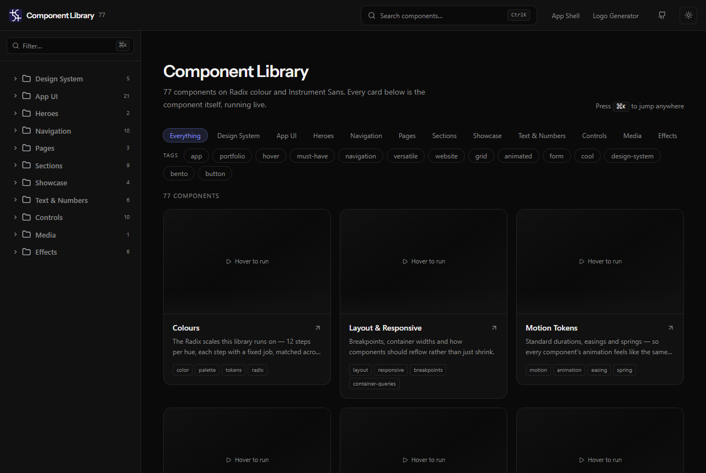

<p align="center">
  
</p>

<h1 align="center">Component Library</h1>

<p align="center">
  77 UI components with the micro-interactions already built in, browsable in a live gallery.
</p>

<p align="center">
  <a href="https://component-library-rho.vercel.app/"><strong>Browse the gallery »</strong></a>
  <br /><br />
  <a href="#whats-on-the-shelf">What's on the shelf</a> ·
  <a href="#using-a-component">Using a component</a> ·
  <a href="#run-it-locally">Run it</a>
</p>

<p align="center">
  
  
  
</p>

## Introduction

Ever let the AI scaffold your UI and get handed the same grey card with the same dead grey
button, for the hundredth time? I got tired of that, so I built a shelf: 77 components I picked
and tuned myself, every one with the micro-interactions already baked in (hover reveals, cursor
tracking, staggered entrances). You browse them in a live gallery, find the one you want, and
copy it into your project.

This is not an app you deploy. It is the drawer you open when you start one.

## What's on the shelf

77 components across 11 categories: app UI, marketing sections, heroes, navigation, kinetic
text, media, effects, and a design-system reference. Every entry renders live with sample data,
so you see the real thing moving before you commit to it.

`design` · `app` · `heroes` · `navigation` · `pages` · `sections` · `showcase` · `text` · `controls` · `media` · `effects`

## Using a component

The gallery entry is the usage doc. To take one into your own project: copy the file(s) listed
in its `@source`, install the packages in its `@deps`, and bring the shadcn tokens it uses
(`bg-background`, `text-muted-foreground`, and friends). If it animates, wrap your app in a
`MotionConfig` with `reducedMotion="user"`. Full guide in
[USING-THIS-LIBRARY.md](USING-THIS-LIBRARY.md).

## Tech stack

- **Next.js** – framework and the live gallery
- **Radix Colors** – 12-step semantic token scales
- **shadcn / ui** – component base and CLI install path
- **Motion / Framer Motion** – animation
- **TypeScript + Tailwind** – everything else

## Run it locally

```bash
npm install
npm run dev        # http://localhost:3333
```

The gallery re-scans `src/registry/` on every request, so a new entry appears the moment you
refresh. Scaffold a blank one with `npm run new app my-thing`, and regenerate the catalogue with
`npm run inventory`.

## License

MIT.
